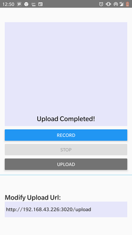

# reactNativeAudio
A simple react-native app to record audio and send to server.

## Description
This project is part of my attempt to learn React-Native.  
It is similar to [reactAudio](https://github.com/HarshalRohit/reactAudio).  

## Screenshot

## Features
Request permission for microphone access (tested on Android).  
Start/Stop recording  
Disable buttons based on the recording state.  
Show user various status updates while recording and uploading files.  
Upload files to server using `multipart/form-data` (looking for better solutions).

## Third-party libraries used
Special thanks to developers of following libraries  
* [react-native-audio-toolkit](https://github.com/react-native-community/react-native-audio-toolkit)
* [rn-fetch-blob](https://github.com/joltup/rn-fetch-blob)

## Environment Setup
Follow the steps mentioned [here](https://reactnative.dev/docs/environment-setup) for **React Native CLI Quickstart**.

## Usage
1. After environment setup, run `npm install` to install dependencies.
2. In the project directory, run `npm start` to start development server.
3. In another terminale, run `npx react-native run-android` to run on an android device or emulator.

## Note
Server setup required, Also modify `uploadUrl` in [App.js](./App.js) accordingly.  
You can use the [server](https://github.com/HarshalRohit/express-try) specfically created for this project.

## License
[MIT](LICENSE)
